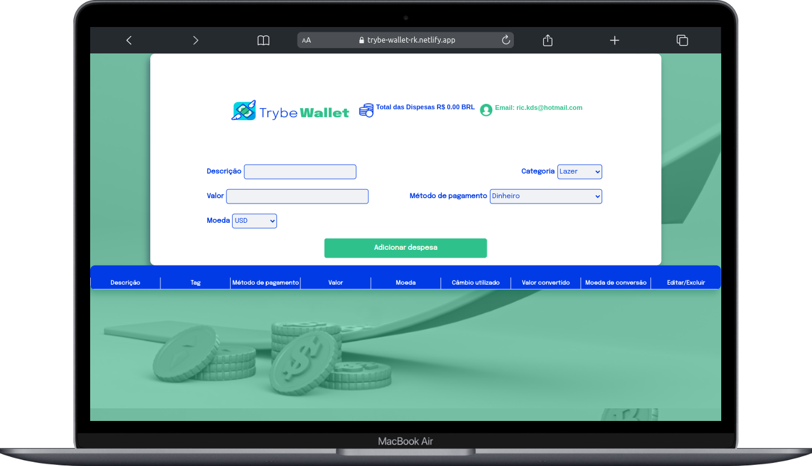
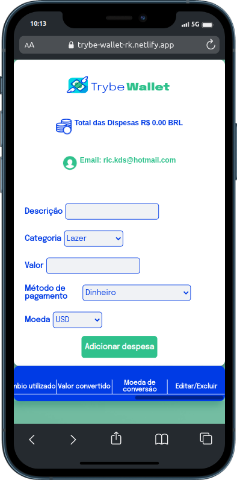

#  Projeto desenvolvido durante o curso de desenvolvimento web Full Stack na [Trybe](https://www.betrybe.com/)

  

  

acesso ao [trybe-wallet](https://trybe-wallet-rk.netlify.app).

---

## 📝 Proposta:
Neste projeto desenvolveu-se uma carteira de controle de gastos com conversor de moedas.

---

## 💡 Habilidades desenvolvidas:

- Criação de um store Redux na aplicação React;

- Criar de reducers no Redux na aplicação React;

- Criação de actions no Redux na aplicação React;

- Criação de dispatchers no Redux na aplicações React;

- Conecção do Redux aos componentes React;

- Criação de actions assíncronas na aplicação React que faz uso de Redux.

---

## ⚙️ API utilizada:
A aplicação faz uso da awesomeapi API de Cotações para realizar a busca de câmbio de moedas.
- https://economia.awesomeapi.com.br/json/all

---

🔗 [Linkedin ricardo-kühlkamp-dev](linkedin.com/in/ricardo-kühlkamp-dev)

---
